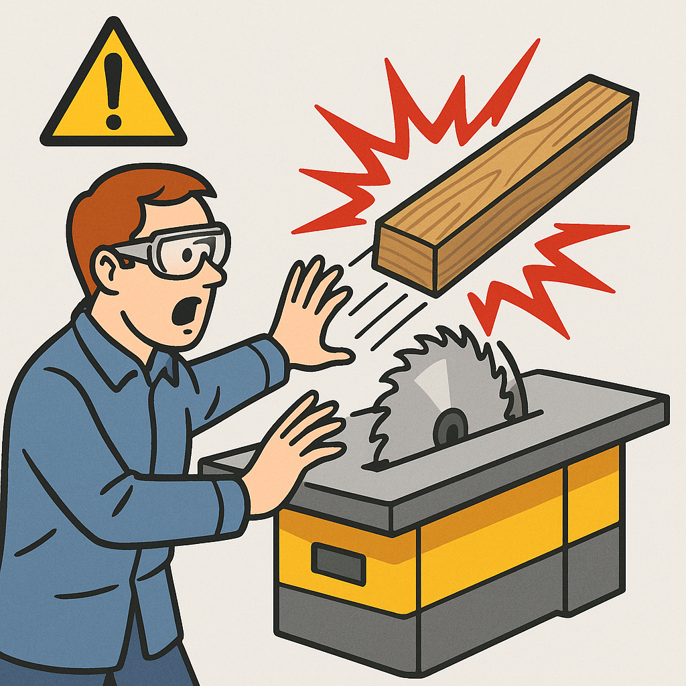

# Kickback_Event_Predictor
The Kickback Event Predictor is an advanced deep learning system designed to forecast dangerous kickback events in industrial machinery by analyzing sensor data patterns. This project addresses a critical safety challenge in manufacturing environments where sudden machine reactions can cause severe injuries and equipment damage.

### ⚠️ Milling Kickback Example

## Key Innovations:
- Early Warning System: Predicts hazardous events 0.5-3 second before occurrence
- Hybrid Deep Learning: Combines 1D CNNs for feature extraction, Attention mechanisms for critical pattern recognition, and LSTMs for temporal modeling
- Industrial-Grade Solution: Processes real-world sensor data with noise handling and robust preprocessing
- Visual Predictive Analytics: Generates intuitive visualizations showing prediction lead time before events

## Technical Highlights:
- Processes 7+ sensor channels simultaneously (TRIAX, power, voltage, current)
- Implements focal loss for handling extreme class imbalance
- Provides multiple evaluation metrics including AUC-ROC, PR-AUC, and Cohen's Kappa
- Optimizes prediction thresholds for maximum F1 scores
- Features modular architecture for easy adaptation to different machinery types

This system enables proactive safety measures in industrial settings, potentially preventing workplace accidents and reducing equipment downtime through early intervention. The solution is particularly valuable for woodworking machinery, industrial presses, and other equipment prone to dangerous kickback reactions.
