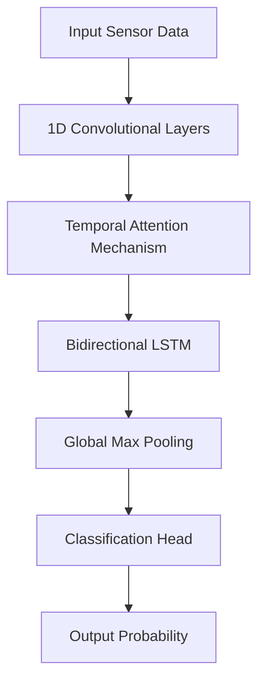

# Sensor Anomaly Prediction using Temporal Attention and LSTM

## Overview
This project implements a deep learning model for predicting sensor anomalies in industrial machinery data. The model combines convolutional layers for feature extraction, temporal attention for focusing on critical time steps, and bidirectional LSTM for sequence modeling.

## Key Features:
- Hybrid Architecture: CNN + Attention + Bidirectional LSTM
- Advanced Data Processing: Custom time parsing and patch generation
- Imbalanced Data Handling: Focal loss function with soft labeling
- Robust Evaluation: Multiple metrics including AUC, PR-AUC, and Cohen's Kappa
- Visualization: Training history and prediction visualization tools
  
## Model Architecture

## Requirements

- Python 3.8+
- PyTorch 1.12+
- pandas
- numpy
- scikit-learn
- matplotlib
- tqdm

## Installation
``` bash
git clone https://github.com/Hassanpragmatics/Kickback_Event_Predictor/.git
cd code
cd Improved Lstm
cd Using_one_by_third_dataset
```

## Usage

Data Preparation:
- Place sensor data in data/ directory
- Update annotations_path in script to point to your annotations CSV

## Training and prediction:
``` bash
python lstm_model.py
``` 
## Evaluation:

- Model performance metrics are printed after training
- Training history and prediction visualizations are saved as PNG files

## Prediction Visualization:

``` bash
visualize_predictions(model, 'data/sample_sensor.csv', scaler, patch_size, stride, future_window, device)
```

## Configuration

``` bash
#Key parameters in the script:

python
patch_size = 500       # Size of input sequences
stride = 100           # Stride for sequence generation
future_window = 100    # Prediction horizon
batch_size = 64        # Training batch size
epochs = 100           # Maximum training epochs
warning_buffer = 0.5   # Buffer period for warning labels
``` 

## Results
The model outputs several evaluation metrics:
- AUC: Area Under ROC Curve
- PR-AUC: Area Under Precision-Recall Curve
- Balanced Accuracy
- Cohen's Kappa
- Optimal Threshold with F1 Score

## Example output:
``` bash
Final Evaluation:
           loss: 0.3521
            auc: 0.9214
        pr_auc: 0.8643
 balanced_acc: 0.8521
        kappa: 0.8012
Optimal Threshold: 0.63 (F1=0.842)
```

## Directory Structure
``` bash
Using_one_by_third_dataset
├── data/                   # Raw sensor data
├── annotations/            # Warning period annotations
├── best_models/                 # Trained model weights
├── lstm_model.py          # main script
├── load.py                 # load script
├── result.txt                 # results
└── README.md               # This document
``` 
